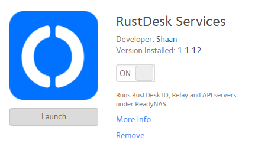

## RustDesk-API Package for ReadyNAS 6

Config package to setup RustDesk API with RustDesk Server (OSS) on the armv7 based ReadyNAS systems.

- Copy the contents of ./apps/ to /apps/ on ReadyNAS. E.g. `rsync -av ./apps/ root@readynas.local:/apps/`
- SSH into ReadyNAS system. E.g. `ssh root@readynas.local`
- Exec: `/frontview/bin/fvapps` and `systemctl restart apache2` to make ReadyNAS copy and pick up the new service definitions.
- Exec: `cd /apps/rustdesk && chmod +x ./update.sh`
- Exec: `./update.sh` to download and install everything. This will include default config.yaml from the author.
- `cd ./conf` and run RustDesk ID server `../hbbs` once to have it generate db and keys. This will produce `id_ed25519`, `id_ed25519.pub` and db files. Verify before next step.
- Adjust settings in `./conf/config.yaml` and `./conf/env`
    - Setting your IP or Hostname in `env:RELAY` is important for proper connectivity between the services.
    - Double-check `id-server`, `relay-server` and `api-server` IP/Hostname and ports. Make sure to do necessary DNS/NAT setup if your server is behind a firewall.
    - Also check `trust-proxy` if the API website is proxied.
- Restart services once more: `for s in fvapp-rustdesk{-relay,-id,}; do systemctl restart $s; done`
- For future updates, just run `cd /apps/rustdesk/ && ./update.sh`. Configured settings are preserved.

References:
- [RustDesk Server (Self Hosted)](https://github.com/rustdesk/rustdesk-server)
- [RustDesk API/Admin by @lejianwen](https://github.com/lejianwen/rustdesk-api/)